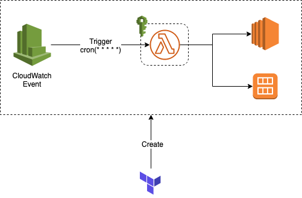
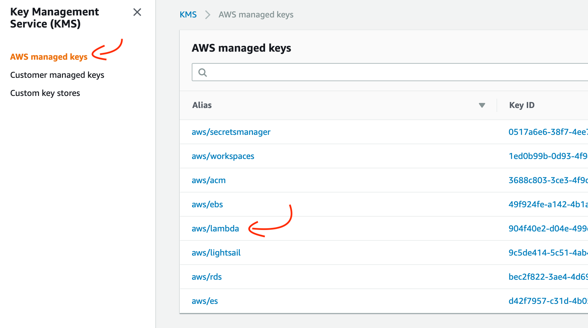
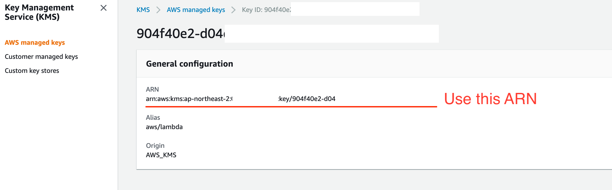

# Daily EC2 AMI Backup by lambda

This project using `Terraform` to help you deploy a AWS `Lambda` function with `IAM Role` and `Cloudwatch Event`.  




## Deployment guide
```bash
# Archive your python code.
$ ./build.py


$ cd terraform/lambda_ami_backup

$ terraform plan
$ terraform apply 
```

## Configuration
Modify terraform/lambda_ami_backup/variables.tf 

```text
variable "ec2_tag_key_env_var" {
    description = "The EC2's tag key that lambda looking up."
    default = "Backup"
}

variable "ec2_tag_value_env_var" {
    description = "The EC2's tag value that lambda looking up."
    default = "by_lambda"
}

variable "schedule_exp" {
    description = "The cloudwatch event schedule expression."
    default = "cron(0 18 * * ? *)"
}

variable "kms_key_arn" {
    description = "The managed KMS key for lambda function. You can copy it from KMS Console > AWS Managed keys > aws/lambda."
    default = "FILL_YOUR_KMS_LAMBDA_KEY_ARM"
}

```
### How to get KMS aws/lambda key ARN.
1. Go to AWS KMS Console.

2. Select AWS managed keys > aws/lambda.


3. Copy your aws/lambda key ARN.


4. Replace `kms_key_arn` default value in `terraform/lambda_ami_backup/variables.tf`.