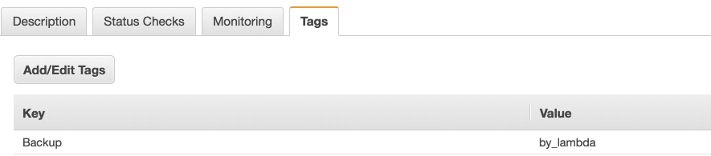

# Daily EC2 AMI Backup by lambda
This project using `Terraform` to help you deploy a AWS `Lambda` function with `IAM Role` and `Cloudwatch Event`.  


If your EC2 has a tag key `Backup` and value `by_lambda`, then it'll be backup AMI by lambda.

**EC2 Tag Example**


# Updated
* 2019-06-24
  * Delete old AMIs, if existing AMIs are exceeded reserved count. (default = 5)
  * Bugfix - Environment variables injection didn't work properly.
* 2019-06-20 
  * KMS lambda target arn is loaded automatically.
  * Bugfix

## Prerequisites
* terraform installed (version >= 0.12.1)
* python3 (version >= 3.7) (if you want to test on your local)

## Deployment guide
```bash
# Archive your python code.
$ ./build.py


$ cd terraform/lambda_ami_backup

$ terraform plan
$ terraform apply 
```

## Configuration
Default `aws region` can be modified on `terraform/labmda_ami_backup/local.tf`.

```text
locals {
  module_dir      = "../../modules"
  aws = {
    region        = "ap-northeast-2"
  }
}
```

If you want to customize, see `terraform/lambda_ami_backup/variables.tf` file.

```text
variable "ec2_tag_key_env_var" {
    description = "The EC2's tag key that lambda looking up."
    default = "Backup"
}   

variable "ec2_tag_value_env_var" {
    description = "The EC2's tag value that lambda looking up."
    default = "by_lambda"
}

variable "schedule_exp" {
    description = "The cloudwatch event schedule expression."
    default = "cron(0 18 * * ? *)"
}

variable "max_images" {
    description = "The maximun count of backup images"
    default = 5
}
```
